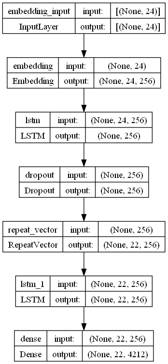

### Neural Machine Translation from English to Belarusian using Seq2Seq Learning
The actual [data](data) contains 3883 phrase pairs of English and Belarusian. 
The data was pre-processed and split into the [train](data/english-belarusian-train.pkl) and [test](data/english-belarusian-test.pkl) sets. 

The model used is an encoder-decoder LSTM model. The architecture of the model is as follows:
